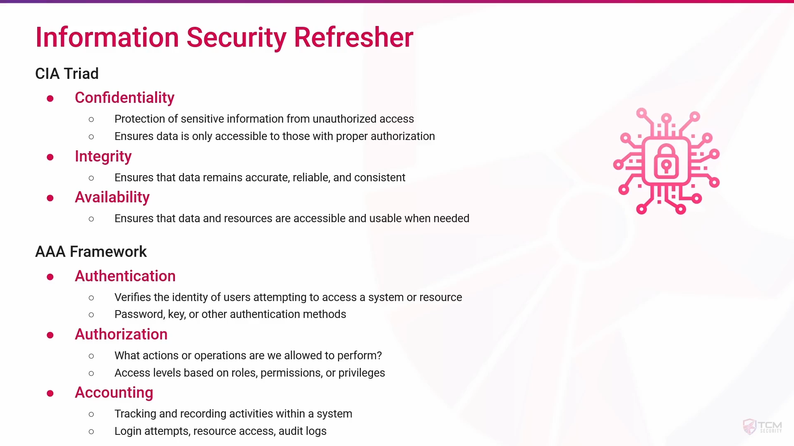
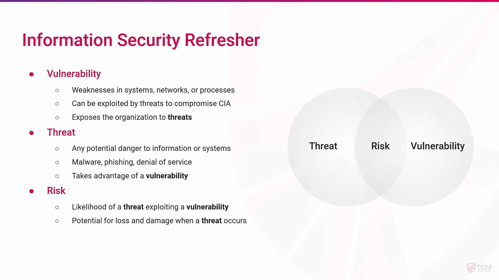
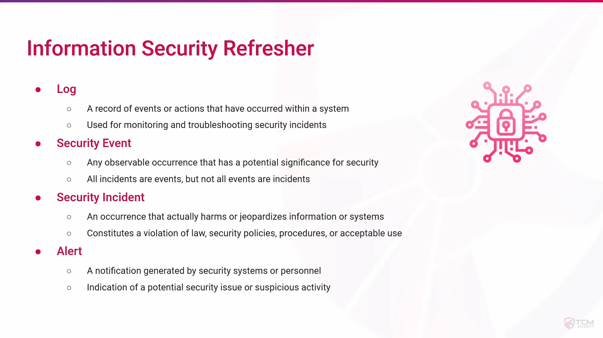
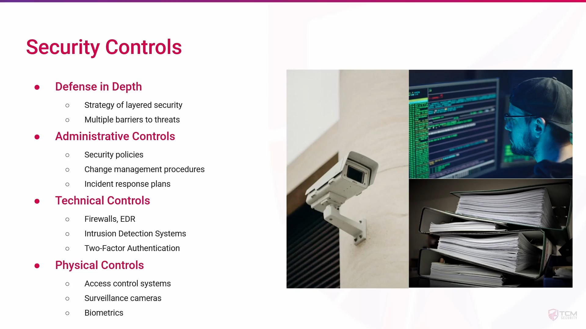
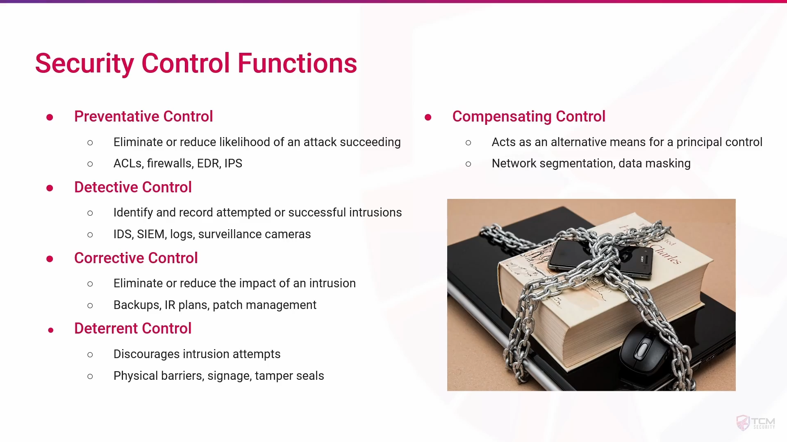
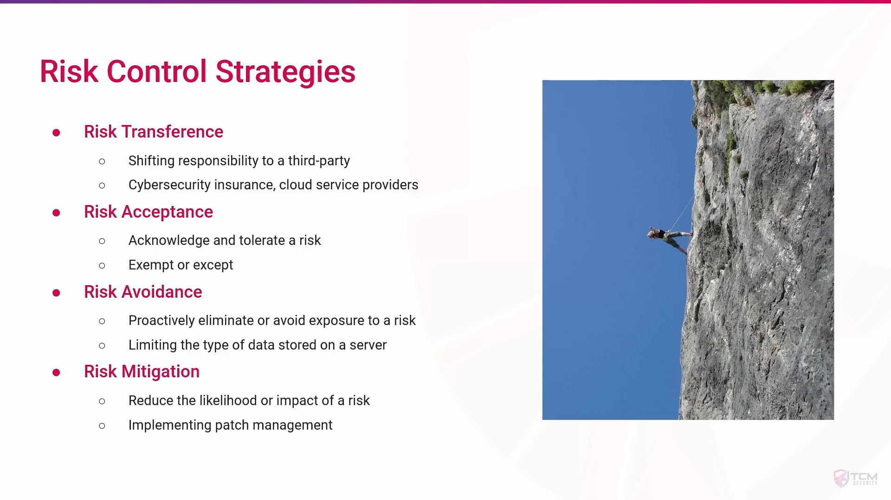
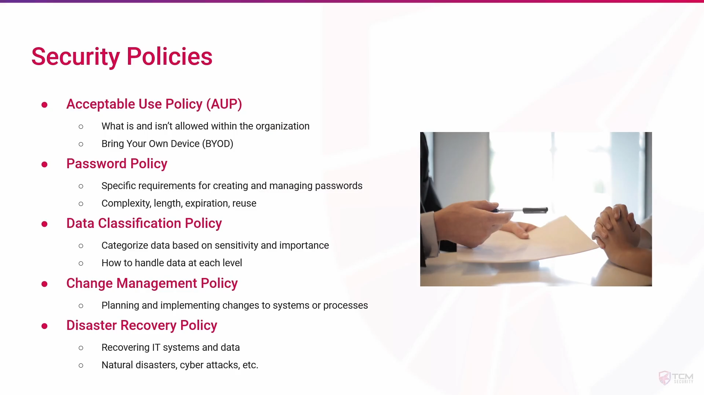

## **1. Overview**

An **Information Security Refresher** is a **review of fundamental concepts, policies, and best practices in information security**. It is designed to ensure that employees or security professionals remain aware of the latest threats, compliance requirements, and safe practices to protect organizational data.

---

## **2. Key Objectives**

- Reinforce knowledge of **confidentiality, integrity, and availability (CIA triad)**.
    
- Update understanding of **current threats and vulnerabilities**.
    
- Promote **security awareness** to prevent human errors.
    
- Ensure compliance with **regulatory and organizational policies**.
    
- Encourage adoption of **best practices** in day-to-day operations.
    

---

## **3. Core Topics in an Information Security Refresher**

1. **Cybersecurity Basics**
    
    - CIA triad: Confidentiality, Integrity, Availability
        
    - Common attack types: Phishing, malware, ransomware, social engineering
        
    - Authentication and access control
        
2. **Data Protection & Privacy**
    
    - Encryption methods (AES, RSA, etc.)
        
    - Secure handling of sensitive information
        
    - GDPR, HIPAA, or local compliance regulations
        
3. **Network Security**
    
    - Firewalls, IDS/IPS, VPNs
        
    - Secure network configuration
        
    - Detecting and responding to suspicious traffic
        
4. **Endpoint Security**
    
    - Anti-virus/anti-malware tools
        
    - Patch management and updates
        
    - Device security policies
        
5. **Incident Response & Reporting**
    
    - Identifying security incidents
        
    - Reporting protocols and escalation paths
        
    - Logging and documentation best practices
        
6. **Password & Account Management**
    
    - Strong password policies
        
    - Multi-factor authentication (MFA)
        
    - Avoiding reuse of credentials
        

---

## **4. Best Practices**

- Regularly **update software and systems**.
    
- Be cautious with **email attachments and links**.
    
- Report suspicious activity immediately.
    
- Follow **organization’s security policies strictly**.
    
- Participate in ongoing **training and refresher sessions**.
    

---

## **5. Benefits**

- **Reduces human error** that leads to breaches.
    
- **Keeps employees up-to-date** with latest threats.
    
- **Supports compliance** with industry regulations.
    
- **Strengthens overall cybersecurity posture** of the organization.
    

---

## **6. Summary**

An **Information Security Refresher** is a structured review of core security principles and practices, aimed at **reinforcing awareness, minimizing risks, and ensuring compliance**. For SOC Analysts, regular refreshers help maintain vigilance against evolving cyber threats.