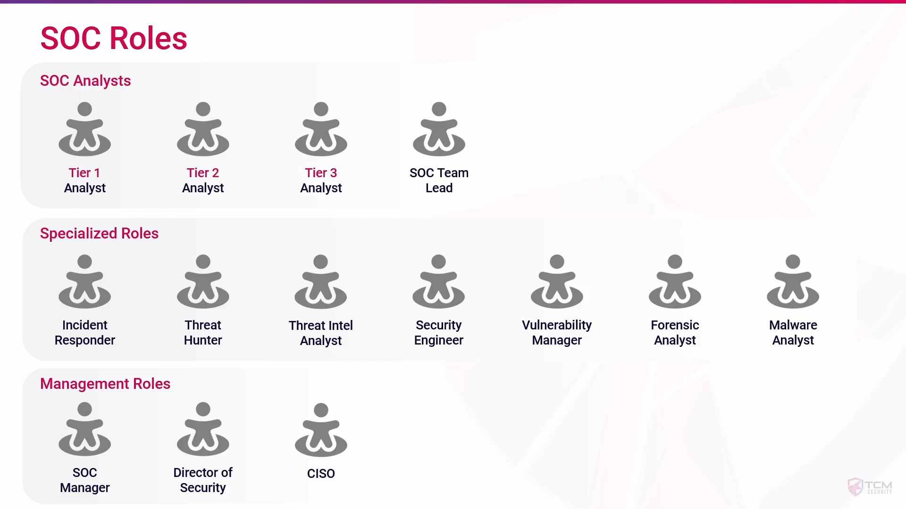
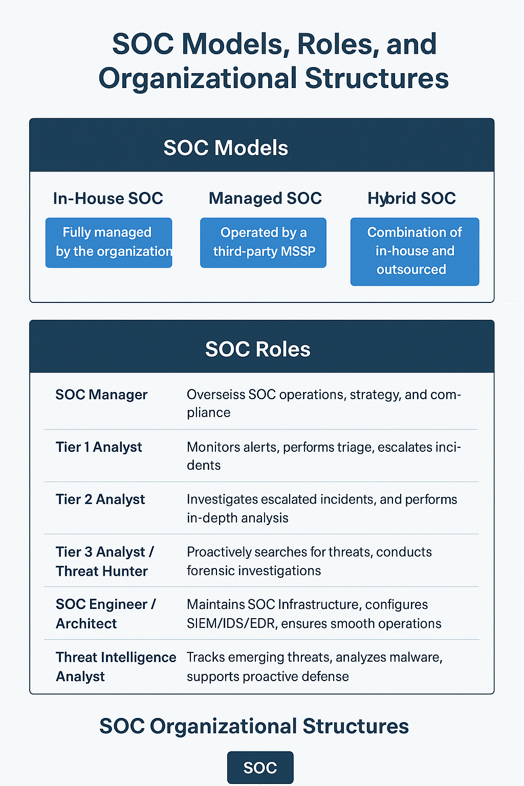

## **1. Overview**

A **Security Operations Center (SOC)** is a centralized unit responsible for monitoring, detecting, and responding to cybersecurity threats. SOCs can be structured in different ways depending on an organization’s size, resources, and risk profile. Understanding **SOC models, roles, and organizational structures** is critical for efficient threat management.

---

## **2. SOC Models**

Different organizations implement SOCs based on resources, requirements, and outsourcing preferences. Common SOC models include:

1. **In-House SOC (Internal SOC)**
    
    - Fully managed by the organization.
        
    - Staffed with internal analysts and engineers.
        
    - Pros: Full control, sensitive data stays internal.
        
    - Cons: High cost, requires skilled staff.
        
2. **Managed SOC (Outsourced SOC)**
    
    - Operated by a third-party Managed Security Service Provider (MSSP).
        
    - Organization receives alerts and reports.
        
    - Pros: Cost-effective, access to expert resources.
        
    - Cons: Less control, potential delay in response.
        
3. **Hybrid SOC**
    
    - Combination of in-house and outsourced SOC.
        
    - Core monitoring handled internally; specialized tasks outsourced.
        
    - Pros: Flexibility, cost optimization, scalability.
        
    - Cons: Coordination challenges, shared responsibilities.
        
4. **Virtual SOC**
    
    - SOC operations are cloud-based or distributed.
        
    - Analysts work remotely, leveraging cloud tools.
        
    - Pros: Low infrastructure cost, 24/7 global coverage.
        
    - Cons: Dependence on cloud security, potential latency issues.
        

---

## **3. SOC Roles**

|**Role**|**Responsibilities**|
|---|---|
|**SOC Manager**|Oversees SOC operations, sets strategy, ensures compliance and KPIs are met.|
|**Tier 1 Analyst (Alert Analyst)**|Monitors alerts, performs initial triage, escalates incidents.|
|**Tier 2 Analyst (Incident Analyst)**|Investigates escalated incidents, performs in-depth analysis.|
|**Tier 3 Analyst / Threat Hunter**|Proactively searches for threats, conducts forensic investigations.|
|**SOC Engineer / Architect**|Maintains SOC infrastructure, configures SIEM/IDS/EDR, ensures smooth operations.|
|**Threat Intelligence Analyst**|Tracks emerging threats, analyzes malware, supports proactive defense.|
|**Incident Responder**|Leads containment, eradication, and recovery actions during incidents.|

---

## **4. SOC Organizational Structures**

SOC teams can be structured in different ways depending on their size and function:

1. **Centralized SOC**
    
    - Single physical location.
        
    - All monitoring, analysis, and response centralized.
        
    - Suitable for large enterprises with high-security needs.
        
2. **Distributed SOC**
    
    - Multiple locations or offices, each with SOC capabilities.
        
    - Can cover global operations with local context.
        
    - Requires strong coordination.
        
3. **Virtual/Cloud-Based SOC**
    
    - Analysts work remotely using cloud-based monitoring tools.
        
    - Reduces infrastructure costs and supports 24/7 operations.
        
4. **Functional Structure**
    
    - Teams divided by roles (monitoring, analysis, threat intelligence, incident response).
        
    - Encourages specialization and clear responsibility.
        
5. **Hierarchical Structure**
    
    - Tiered approach (Tier 1 → Tier 2 → Tier 3).
        
    - Efficient escalation of incidents from low to high complexity.
        

---

## **5. Best Practices for SOC Organization**

- Maintain **clear escalation paths** for incidents.
    
- Ensure **24/7 coverage** through shift rotations or global distribution.
    
- Implement **specialized roles** to handle monitoring, intelligence, and incident response efficiently.
    
- Regularly **train staff** on latest threats, tools, and procedures.
    
- Use **metrics and KPIs** to assess SOC performance (e.g., Mean Time to Detect, Mean Time to Respond).
    

---

## **6. Summary**

SOC models, roles, and organizational structures define how an organization **monitors, analyzes, and responds** to cybersecurity threats. Selecting the right model and structure ensures **efficient threat detection, rapid incident response, and strong organizational security posture**.