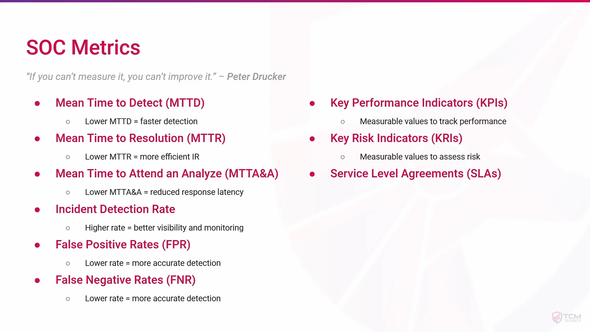

SOC Metrics are measurable indicators used by a Security Operations Center (SOC) to evaluate its performance, effectiveness, and efficiency in detecting, responding to, and mitigating security incidents.

---
### Purpose:

- To **assess SOC performance** and improvement areas.
    
- To **ensure timely detection and response** to threats.
    
- To **demonstrate value to management** and stakeholders.
    
- To **optimize resource allocation** and operational processes.
    

### Types of SOC Metrics:

1. **Operational Metrics**  
    Focus on SOC day-to-day operations and efficiency.  
    Examples:
    
    - Number of alerts received
        
    - Number of incidents investigated
        
    - Average time to triage alerts
        
2. **Performance Metrics**  
    Measure how effectively the SOC detects and responds to threats.  
    Examples:
    
    - Mean Time to Detect (MTTD)
        
    - Mean Time to Respond (MTTR)
        
    - False positive/negative rate
        
3. **Outcome Metrics**  
    Evaluate the impact of SOC actions on organizational security posture.  
    Examples:
    
    - Number of incidents successfully contained
        
    - Reduction in repeat incidents
        
    - Threat coverage improvement
        
4. **Compliance Metrics**  
    Ensure adherence to regulatory requirements and internal policies.  
    Examples:
    
    - Percentage of incidents logged and reported according to policy
        
    - Audit and compliance checks passed
        

### Key Points:

- SOC Metrics provide **quantitative insight** into SOC effectiveness.
    
- They help **identify gaps** in monitoring, detection, and response.
    
- Metrics should be **regularly reviewed** and aligned with business objectives.

|**Metric Type**|**Metric**|**Description**|**Example / Target**|
|---|---|---|---|
|**Operational**|Alerts Received|Total number of security alerts generated|500 alerts/day|
||Incidents Investigated|Number of alerts escalated and investigated|120 incidents/week|
||Average Triage Time|Time taken to analyze and prioritize an alert|≤ 30 minutes per alert|
|**Performance**|Mean Time to Detect (MTTD)|Average time to identify a security incident|≤ 15 minutes|
||Mean Time to Respond (MTTR)|Average time to contain and remediate an incident|≤ 2 hours|
||False Positive Rate|Percentage of alerts incorrectly flagged as threats|≤ 5%|
|**Outcome**|Incidents Contained|Number of incidents successfully mitigated|95% of incidents contained|
||Repeat Incidents|Number of recurring incidents|Reduction by 20% month-over-month|
||Threat Coverage|Percentage of known threats detected|≥ 90% coverage|
|**Compliance**|Incident Logging Compliance|% of incidents logged according to internal policy|100%|
||Regulatory Audit Pass Rate|% of successful compliance audits|100%|

**Tips for SOC Analysts:**

- Track metrics **daily/weekly/monthly** depending on type.
    
- Prioritize **MTTD and MTTR** to improve incident response efficiency.
    
- Use metrics to **report SOC performance** to management.